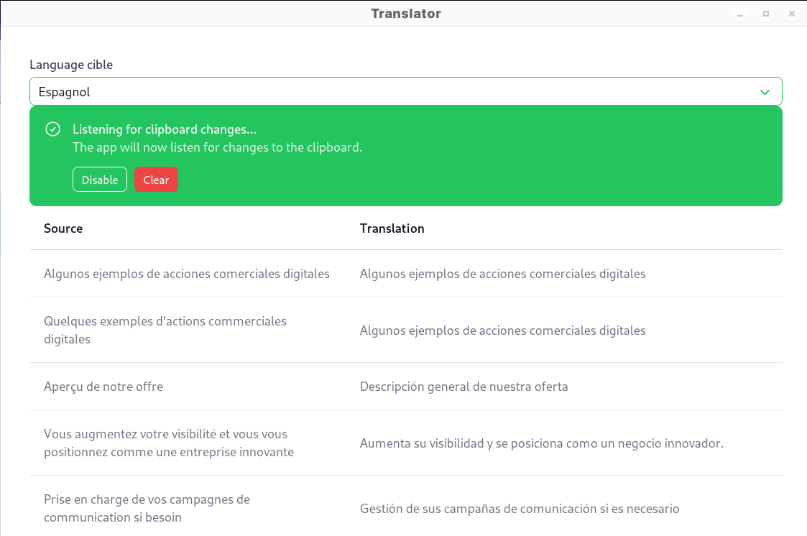

# CTRL-C Translator 
**(made in 2h so don't expect much only usefull if you need to know how to hook shortcuts on Wayland)**  


## Build locally
```sh
# Setup deps
pnpm install

# Build
pnpm run tauri build

# Release in ./src-tauri/target/release
```

## Notes
- change log level with `RUST_LOG` env variable
- you can replace google translate with [libretranslate](https://github.com/LibreTranslate/LibreTranslate) : replace the default feature `google` with `libretranslate` in [Cargo.toml](./src-tauri/Cargo.toml) and change the libretranslate url in [main.rs](./src-tauri/src/main.rs)

## Used
- As a template [Huakunshen/Tauri-nuxt-platemplate](https://github.com/HuakunShen/tauri-nuxt-template)
- To make the UI quick [Nuxt UI](https://ui.nuxt.com/)
